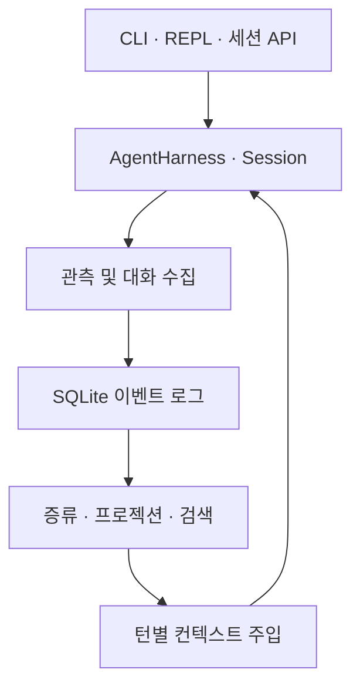

# mori

Memory-native agent harness. Sessions die; memory remains.

AI 에이전트의 세션을 넘어 작업 맥락을 보존하기 위한 하네스와 SQLite 메모리 커널.
[`mori-nest`](https://github.com/shakystar/mori-nest)는 공유 기억 프로토콜과 서버를 다루는 연관 프로젝트다.

## 프로젝트 상태

군 복무 중 개인 프로젝트로 개발했다. 모델 API 사용과 반복 평가에 드는 비용, 복무 중 확보할 수 있는 개발 시간, 관련 도구의 등장을 함께 고려해 추가 개발을 종료했다. 구현한 코드와 검증 기록을 보존하며, 신규 기능 개발과 정기 유지보수는 계획하지 않는다.

라이선스는 [MIT](LICENSE)다. 구현·검증 범위는 [최종 상태](docs/final-status.md),
중요한 설계 판단과 평가 결과는 [프로젝트 사례](docs/case-study.md)에 정리했다.
기존 설계·평가 문서는 각 작성 시점의 기록으로 보존한다.

## 구현의 중심

- **메모리 처리:** 관측·대화 수집, 증류, 검색, 턴별 컨텍스트 주입을 하네스 생명주기에 연결했다.
- **일관성:** 이벤트 로그를 기준으로 프로젝션을 재구성하고, compare-and-append와 증거 바인딩으로 오래된 판단의 커밋을 거부한다.
- **압축 경계:** 같은 Session의 append-only entry log를 읽는 어댑터로 압축 이전 대화를 증류 경로에 전달한다.
- **평가:** memory-on/off/oracle 비교, 호출 비용 기록, 캐시 재생 및 오염·변동성 분석 자료를 남겼다.



이 그림은 로컬 실행 경로다. mori-nest와의 자동 동기화·종단 간 서비스 운영까지 완료했다는 뜻은 아니다.
메모리 사용의 일반적인 성능 우위도 확정하지 않았다. [검증 결과와 한계](docs/final-status.md)를 함께 참고한다.

## Quickstart — 소스에서 실행

확인한 도구체인은 **Node 22.23.1 · pnpm 10.30.3**이다. pnpm을 준비한 뒤:

```bash
git clone https://github.com/shakystar/mori.git
cd mori
pnpm install --frozen-lockfile
pnpm build
```

실제 모델을 사용하는 다음 명령은 해당 제공자의 API 비용이 발생한다.

```bash
export ANTHROPIC_API_KEY=YOUR_API_KEY
pnpm --filter @shakystar/mori exec node dist/index.js "hi"
```

아래 사용 설명의 `mori`는 위 소스 빌드에서는
`pnpm --filter @shakystar/mori exec node dist/index.js`로 실행할 수 있다.
npm 배포 상태에 의존하지 않고 소스 실행을 재현 경로로 삼는다.

실제 모델을 호출하지 않는 검증 명령과 Linux 환경 조건은 [최종 상태](docs/final-status.md#재현-명령)에 있다.

### REPL

Run `mori` with no prompt from a terminal and it opens a REPL, so a conversation can run
over several turns instead of one:

```
$ mori
mori REPL — /exit 또는 Ctrl-D로 종료, /clear로 대화 초기화, /consolidate로 증류 실행
› what does packages/kernel do?
...
› now summarise that in one line
...
```

Every turn runs on the same agent, so earlier turns stay in context — the second question
above can refer to the first answer.

| Input                | Effect                                                       |
| -------------------- | ------------------------------------------------------------ |
| `/exit`, Ctrl-D      | leave the REPL (exit code 0)                                 |
| `/clear`             | forget the conversation so far and keep going                |
| `/consolidate`       | run a consolidation boundary now (see "Consolidation" below) |
| Ctrl-C during a turn | cancel that turn only; the REPL stays open                   |
| Ctrl-C while idle    | leave the REPL (exit code 0)                                 |
| an empty line        | ignored — no request is sent                                 |

There are no slash commands beyond the three above, and no history file, completion, or
session save/restore.

The prompt for the next turn is only printed once the previous answer has finished
streaming, so output and input never interleave. Anything typed while a turn is streaming
is discarded rather than queued: it is not echoed into the response and does not carry over
into the next prompt. Ctrl-C is the one keystroke a running turn still listens for.

`mori` with no prompt **only** enters the REPL when stdin is a terminal. With stdin piped,
redirected, or closed there is nobody to prompt, so it prints usage and exits 1 rather than
looping — to send a prompt non-interactively, pass it as an argument (`mori "hi"`).

### Authentication

mori resolves credentials in this order:

1. A credential stored by a prior `mori login` (at `$XDG_CONFIG_HOME/mori/credentials.json`,
   or `~/.config/mori/credentials.json`, written `0600`).
2. The provider's API key environment variable — `ANTHROPIC_API_KEY`, `OPENAI_API_KEY`, or
   `DEEPSEEK_API_KEY`.

If neither is available, `mori` exits immediately with an error naming both options — no
network round trip is attempted first.

```bash
mori login             # stores a key for the provider MORI_MODEL selects (anthropic by default)
mori login openai      # ...or for a provider you name
mori logout openai     # drops that provider's stored credential
```

For `anthropic` and `openai`, `mori login` prompts for an API key and stores it; it is a
convenience over exporting the environment variable, not a different kind of credential.
Neither provider has a subscription/OAuth login: Claude Pro/Max OAuth is deliberately not
implemented (it requires impersonating another client, which its terms forbid), and mori
strips that capability out of the provider it registers.

### Provider and model selection

mori supports three providers by default: `anthropic` (default), `openai`, and `deepseek`.
All three go through their own API key (see Authentication above).

By default mori uses the anthropic model `claude-sonnet-4-6`. Override the model — and
optionally the provider — with `MORI_MODEL`:

```bash
# anthropic (default provider), just the model id, e.g.:
MORI_MODEL=claude-opus-5 mori "hi"

# a different provider: "<provider>/<model>"
export OPENAI_API_KEY=sk-...
MORI_MODEL=openai/gpt-5.4 mori "hi"

export DEEPSEEK_API_KEY=sk-...
MORI_MODEL=deepseek/deepseek-v4-flash mori "hi"
```

Rule: if `MORI_MODEL` contains a `/`, everything before it is the provider id and
everything after is the model id. A bare value (no `/`) has no provider and is read as an
anthropic model id, so the pre-existing `MORI_MODEL=claude-sonnet-4-6` form keeps working
unchanged. An unknown provider or model ends with an error listing what's supported —
no stack trace.

### Experimental: ChatGPT subscription login (unofficial, off by default)

> **This is not a supported feature, and using it may get your OpenAI account restricted or
> suspended.** OpenAI has never stated in its auth documentation that third-party clients
> may sign in with a ChatGPT subscription. This route exists as an unofficial development
> path only. If you need something that keeps working, use `OPENAI_API_KEY` with the
> `openai` provider above.

It is off unless you set the gate to exactly `1`, and while it is off the provider is not
registered at all — it does not appear in the supported-provider list, it cannot be selected
by `MORI_MODEL`, and `mori login` will not accept it as a target:

```bash
export MORI_EXPERIMENTAL_OPENAI_OAUTH=1
mori login openai-codex        # prints the risk notice on success
MORI_MODEL=openai-codex/gpt-5.1-codex mori "hi"
```

Note that `openai-codex` is a _different provider_ from `openai`: it talks to
`chatgpt.com/backend-api` and has no API key path at all, so `OPENAI_API_KEY` does not
apply to it.

### Data location

mori's memory kernel keeps its on-disk state under `~/.mori` (override with
`MEMORIZE_ROOT`) — no per-account nesting, since mori has no CLI account
concept. Each project's `better-sqlite3` database lives at
`~/.mori/projects/<projectId>/mori.db`; the db itself stays in this global
home, not under the working root.

`projectId` resolves in this order (`packages/mori/src/kernel/index.ts:283-288`):
a committed `.mori/project.json`'s `id` field takes precedence when the file
is present and valid; otherwise it falls back to a hash of the working root
(`packages/mori/src/kernel/index.ts:273-276`). The first time a checkout runs
with **no** `.mori/project.json`, mori writes one with the path-hash id it
just resolved; once that file is committed and pushed, every other checkout
that pulls it adopts the same id instead of re-deriving its own. If the file
exists but can't be used (unparseable, or an id that doesn't match the
expected shape), mori warns and falls back to the path hash but **never
overwrites it** — a committed file is a human's to fix, not mori's.

`.mori/project.json` is meant to be **committed to the repo**, not
gitignored — that's what lets a fresh clone and every worktree of the same
repo (each at a different absolute path, so each would otherwise hash to a
different id) resolve to the same id and share one store.

The file holds **only the project id** — never a hub address or credential.
A committed file is reachable by anyone who can open a pull request against
the repo, including a malicious fork; if it could steer where memory is sent,
that would be enough to exfiltrate it to an attacker-controlled hub (see
mori-nest `docs/design/0001-protocol-requirements.md:79-81`, §2.5). The hub a
session talks to is decided outside this file, by whatever launched it.

What lands there: for every **successful** `edit_file` call, the file path (not
the file contents); for every successful `bash` call whose command text looks
state-changing (`git commit`, a package install, an `rm`, …) or reads like a
decision being recorded, the command text. Read-only tool calls (`read_file` /
`list_dir` / `grep`) and read-only shell commands are not recorded. Nothing is
written until the first such call, so a session that only reads leaves no trace
on disk.

### Consolidation

Consolidation is the step that turns captured observations into distilled, searchable
memories. It is off by default — set `MORI_CONSOLIDATE_MODEL` to the model it should use
(same `[provider/]model` syntax as `MORI_MODEL`; a bare model id resolves against
`anthropic`):

```bash
export MORI_CONSOLIDATE_MODEL=claude-opus-5
```

With it set, explicit/session-end boundaries and the post-compaction boundary are available:

- **After compaction** — the harness publishes a `session_compact` event and starts consolidation in the background; it does not await distillation in the compaction observer.
- **Session end** — automatic, once, right before `mori` or the REPL exits. A boundary
  failure here is reported to stderr and otherwise ignored: it never changes the exit code
  or interrupts a running turn, because the next session's session-end boundary retries the
  same window.
- **`/consolidate`** — the REPL's explicit trigger (see the command table above). Unlike
  the automatic one, a failure here is reported to you directly, since you asked for it by
  name.

`MORI_CONSOLIDATE_MODEL` unset means these LLM-backed boundaries quietly do nothing — no error, no
warning. The same applies when nothing has been captured yet: a session-end boundary over a
store that was never created (a session that only read files) is skipped rather than being
the thing that creates it, so the "no trace on disk" guarantee above holds whether or not
consolidation is configured.

### Programmatic use

`@shakystar/mori` exports `createMoriSession` for driving a multi-turn session from code —
no terminal required, which is what a harness (a test, a benchmark runner) needs:

```ts
import { createMoriSession } from "@shakystar/mori";

const result = await createMoriSession(process.env);
if (!result.ok) process.exit(result.exitCode);

const { session } = result;
const first = await session.prompt("what does packages/kernel do?");
console.log(first.text, first.usage);

await session.consolidate(); // the /consolidate REPL command, callable mid-session
await session.close(); // settles observations + runs the session-end consolidation trigger
```

Each `prompt()` call reports the turn's reply text, its `stopReason`, and its token/cost
`usage` (summed across every provider round-trip the turn made, in case of a tool-call
loop). `consolidate()` and `close()` are the triggers described above, reachable
without a REPL session around them.

## Tools

### `bash` — not a sandbox

The `bash` tool runs shell commands in a child process. **It is not a sandbox, and it
does not confine the model to the working root.** A shell can read and write anything
the user running mori can; a command string is never parsed for intent, so
`cat ../../etc/passwd` leaves the working root and nothing stops it. String matching
cannot close that hole, and pretending otherwise would be worse than saying it plainly.

What the tool actually guarantees:

- the child's working directory is pinned to the working root, so relative paths have a
  known base
- a fixed list of obviously destructive commands (root deletion, `--no-preserve-root`,
  writes straight to a disk device, `mkfs`, fork bombs) is refused before execution by a
  `beforeToolCall` preflight hook — a guard against accidents, not against an adversary
- every command has a wall-clock timeout; on overrun the whole process group is killed
  and the partial output is returned with the timeout flagged
- output is capped per stream and truncation is reported
- stdin is not connected, so interactive commands fail immediately instead of hanging
- mori's own Anthropic credentials (`ANTHROPIC_API_KEY`, `ANTHROPIC_AUTH_TOKEN`,
  `ANTHROPIC_ADMIN_KEY`) are removed from the child environment; everything else in the
  environment is inherited as-is

**Do not run mori with the `bash` tool enabled on untrusted prompts or untrusted
content.** Real isolation (container, seccomp, a permission system) is not implemented.

## Development

See [TESTING.md](./TESTING.md) for this repo's testing conventions before adding or
changing tests.

See [docs/storage-boundary-secrets.md](./docs/storage-boundary-secrets.md) — the
canonical reference for what mori's storage boundary defends against (credential
shapes, raw tool payloads) and where each defense's limits are — before touching
capture, consolidate, or the mask-secrets module.
