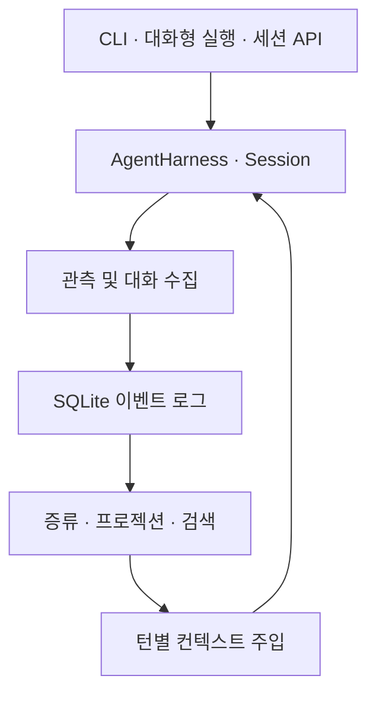

# mori

세션을 넘어 기억을 유지하는 AI 에이전트 실행 환경.

작업 맥락을 수집·증류·검색하는 SQLite 메모리 커널을 에이전트 하네스에 연결한 프로젝트다.
[`mori-nest`](https://github.com/shakystar/mori-nest)는 공유 기억 프로토콜과 서버를 다루는 연관 프로젝트다.

## 프로젝트 상태

군 복무 중 개인 프로젝트로 개발했다. 모델 API 사용과 반복 평가에 드는 비용, 복무 중 확보할 수 있는 개발 시간, 관련 도구의 등장을 함께 고려해 추가 개발을 종료했다. 구현한 코드와 검증 기록을 보존하며, 신규 기능 개발과 정기 유지보수는 계획하지 않는다.

라이선스는 [MIT](LICENSE)다. 구현·검증 범위는 [최종 상태](docs/final-status.md),
중요한 설계 판단과 평가 결과는 [프로젝트 사례](docs/case-study.md)에 정리했다.
기존 설계·평가 문서는 각 작성 시점의 기록으로 보존한다.

## 핵심 구현

- **메모리 처리:** 관측·대화 수집, 증류, 검색, 턴별 컨텍스트 주입을 하네스 생명주기에 연결했다.
- **일관성:** 이벤트 로그를 기준으로 프로젝션을 재구성한다. 로그의 기준 상태를 비교한 뒤 추가하는 방식과 증거 바인딩으로 오래된 판단의 커밋을 거부한다.
- **압축 경계:** 같은 `Session`에 누적되는 항목 로그를 읽는 어댑터로 압축 이전 대화를 증류 경로에 전달한다.
- **평가:** 메모리 미사용·사용·정답 단서 제공 조건을 비교하고, 호출 비용·캐시 재생·오염·변동성 분석 자료를 남겼다.



이 그림은 로컬 실행 경로다. mori-nest와의 자동 동기화·종단 간 서비스 운영까지 완료했다는 뜻은 아니다.
메모리 사용의 일반적인 성능 우위도 확정하지 않았다. [검증 결과와 한계](docs/final-status.md)를 함께 참고한다.

## 시작하기 — 소스에서 실행

확인한 도구체인은 **Node 22.23.1 · pnpm 10.30.3**이다. pnpm을 준비한 뒤 실행한다.

```bash
git clone https://github.com/shakystar/mori.git
cd mori
pnpm install --frozen-lockfile
pnpm build
```

실제 모델을 사용하는 다음 명령은 해당 제공자의 API 비용이 발생한다.

```bash
export ANTHROPIC_API_KEY=YOUR_API_KEY
pnpm --filter @shakystar/mori exec node dist/index.js "안녕"
```

아래 설명의 `mori` 명령은 위 소스 빌드에서는
`pnpm --filter @shakystar/mori exec node dist/index.js`로 실행할 수 있다.
npm 배포 상태에 의존하지 않고 소스 실행을 재현 경로로 삼는다.

실제 모델을 호출하지 않는 검증 명령과 Linux 환경 조건은 [최종 상태](docs/final-status.md#재현-명령)에 있다.

### 대화형 실행(REPL)

터미널에서 프롬프트 인자 없이 `mori`를 실행하면 여러 턴에 걸쳐 대화할 수 있다.

```text
$ mori
mori REPL — /exit 또는 Ctrl-D로 종료, /clear로 대화 초기화, /consolidate로 증류 실행
› packages/kernel은 어떤 역할을 해?
...
› 방금 설명을 한 문장으로 요약해 줘
...
```

모든 턴은 같은 에이전트에서 실행되므로 이전 대화가 컨텍스트에 남는다.
위 예시의 두 번째 질문은 첫 번째 답변을 참조할 수 있다.

| 입력                | 동작                                  |
| ------------------- | ------------------------------------- |
| `/exit`, Ctrl-D     | 종료 코드 0으로 대화형 실행 종료      |
| `/clear`            | 현재 대화 내용을 초기화하고 계속 진행 |
| `/consolidate`      | 즉시 증류 실행. 아래 ‘기억 증류’ 참고 |
| 턴 실행 중 Ctrl-C   | 해당 턴만 취소하고 대화형 실행은 유지 |
| 입력 대기 중 Ctrl-C | 종료 코드 0으로 대화형 실행 종료      |
| 빈 줄               | 요청을 보내지 않고 무시               |

슬래시 명령은 위 세 개만 지원한다. 입력 이력 파일, 자동 완성, 세션 저장·복원 기능은 없다.

다음 입력 프롬프트는 이전 답변의 스트리밍이 끝난 뒤 표시한다. 스트리밍 중 입력한 문자는
대기열에 넣지 않고 버리므로 답변에 섞이거나 다음 입력으로 넘어가지 않는다.
실행 중인 턴에서는 Ctrl-C만 처리한다.

프롬프트 인자 없는 `mori`는 표준 입력이 터미널일 때만 대화형 모드로 진입한다.
파이프·리다이렉션을 사용하거나 표준 입력이 닫혀 있으면 사용법을 출력하고 종료 코드 1로 끝난다.
비대화형 실행에서는 `mori "안녕"`처럼 프롬프트를 인자로 전달한다.

### 인증

인증 정보는 다음 순서로 찾는다.

1. `mori login`으로 저장한 인증 정보. 위치는 `$XDG_CONFIG_HOME/mori/credentials.json`,
   미설정 시 `~/.config/mori/credentials.json`이며 파일 권한은 `0600`이다.
2. 제공자별 API 키 환경 변수: `ANTHROPIC_API_KEY`, `OPENAI_API_KEY`, `DEEPSEEK_API_KEY`.

둘 다 없으면 두 설정 방법을 안내하는 오류와 함께 즉시 종료한다. 그 전에 네트워크 요청을 보내지 않는다.

```bash
mori login             # MORI_MODEL이 선택한 제공자의 키 저장. 기본값은 anthropic
mori login openai      # 지정한 제공자의 키 저장
mori logout openai     # 지정한 제공자의 저장된 인증 정보 삭제
```

`anthropic`과 `openai`의 `mori login`은 API 키를 입력받아 저장한다.
환경 변수를 매번 설정하는 대신 사용하는 편의 기능이며, 구독 계정이나 OAuth 로그인은 아니다.
Claude Pro/Max의 OAuth 로그인은 구현하지 않았고, 등록하는 Anthropic 제공자에서도 해당 기능을 제외했다.

### 제공자와 모델 선택

기본 제공자는 `anthropic`, `openai`, `deepseek` 세 가지이며, 각각의 API 키를 사용한다.
기본 모델은 `anthropic`의 `claude-sonnet-4-6`이다.
`MORI_MODEL`로 모델과 제공자를 지정할 수 있다.
아래 식별자는 보존된 구현의 사용 예시이며, 제공자의 현재 모델 제공 여부를 보증하지 않는다.

```bash
# 기본 제공자 anthropic의 모델만 지정
MORI_MODEL=claude-opus-5 mori "안녕"

# 다른 제공자는 "<제공자>/<모델>" 형식으로 지정
export OPENAI_API_KEY=YOUR_API_KEY
MORI_MODEL=openai/gpt-5.4 mori "안녕"

export DEEPSEEK_API_KEY=YOUR_API_KEY
MORI_MODEL=deepseek/deepseek-v4-flash mori "안녕"
```

`MORI_MODEL`에 `/`가 있으면 앞부분을 제공자 ID, 뒷부분을 모델 ID로 해석한다.
`/`가 없으면 `anthropic` 모델 ID로 해석하므로 `MORI_MODEL=claude-sonnet-4-6`도 사용할 수 있다.
알 수 없는 제공자나 모델을 지정하면 지원 목록을 안내하고 종료하며, 스택 추적은 출력하지 않는다.

### 실험 기능: ChatGPT 구독 로그인

이 경로는 공식 지원 기능이 아닌 개발용 실험이며 기본적으로 비활성화되어 있다.
지원 여부나 이용 조건을 보증하지 않는다. 일반적인 OpenAI API 사용은 위의
`openai` 제공자와 `OPENAI_API_KEY` 설정을 따른다.

`MORI_EXPERIMENTAL_OPENAI_OAUTH`를 정확히 `1`로 설정해야 활성화된다.
비활성화 상태에서는 제공자를 등록하지 않으므로 지원 목록에 나타나지 않고,
`MORI_MODEL`이나 `mori login`의 대상으로도 사용할 수 없다.

```bash
export MORI_EXPERIMENTAL_OPENAI_OAUTH=1
mori login openai-codex        # 성공 시 실험 기능에 대한 주의 안내 출력
MORI_MODEL=openai-codex/gpt-5.1-codex mori "안녕"
```

`openai-codex`는 `openai`와 별개의 제공자다.
`chatgpt.com/backend-api`에 연결하며 API 키 경로가 없으므로 `OPENAI_API_KEY`는 적용되지 않는다.

### 데이터 저장 위치

메모리 커널은 `~/.mori` 아래에 데이터를 저장한다. `MEMORIZE_ROOT`로 위치를 바꿀 수 있다.
CLI에 계정 개념이 없으므로 계정별 하위 디렉터리는 만들지 않는다.
프로젝트별 `better-sqlite3` 데이터베이스는 `~/.mori/projects/<projectId>/mori.db`에 있으며,
작업 디렉터리 내부가 아닌 이 공통 저장 위치를 사용한다.

프로젝트 ID는 `.mori/project.json`이 있고 유효하면 그 파일의 `id`를 우선 사용한다.
그렇지 않으면 작업 디렉터리 경로의 해시를 사용한다.
`.mori/project.json`이 없는 체크아웃을 처음 실행하면 계산한 경로 해시 ID로 파일을 만든다.
이 파일을 커밋·푸시하면 다른 체크아웃도 같은 ID를 사용한다.
파일을 읽을 수 없거나 ID 형식이 잘못됐다면 경고 후 경로 해시로 대체하지만,
기존 파일은 덮어쓰지 않는다. 잘못된 커밋 파일은 사용자가 수정해야 한다.

`.mori/project.json`은 `.gitignore`로 제외하지 않고 **저장소에 커밋하는 파일**이다.
그래야 절대 경로가 서로 다른 복제본과 작업 트리에서도 같은 프로젝트 ID로 같은 저장소를 참조한다.

이 파일에는 **프로젝트 ID만** 넣는다. 허브 주소나 인증 정보는 넣지 않는다.
PR이나 포크를 통해 수정될 수 있는 파일이 기억 전송 목적지를 결정하면 정보 유출 경로가 될 수 있기 때문이다.
허브 연결 대상은 프로젝트 ID 파일 밖에서 실행 주체가 정하는 설계다.
이 설명이 mori-nest와의 자동 동기화 구현 완료를 뜻하지는 않는다.

관측 수집 경로에서 기록하는 내용은 다음과 같다.

- 성공한 `edit_file` 호출: 파일 내용이 아닌 파일 경로.
- 성공한 `bash` 호출 중 상태 변경이나 결정 기록으로 분류되는 명령: 명령문.
  예를 들어 `git commit`, 패키지 설치, `rm` 등이 해당한다.
- `read_file`, `list_dir`, `grep`과 읽기 전용 셸 명령: 기록하지 않음.

관측용 저장소는 첫 수집 대상 호출 전에는 생성하지 않는다.
따라서 파일 읽기만 한 세션은 메모리 데이터베이스를 만들지 않는다.
이 보장과 별개로 `.mori/project.json`은 앞서 설명한 프로젝트 ID 초기화 과정에서 생성될 수 있다.
기본 대화 어댑터와 저장소가 없는 순수 대화의 수집 제약은 [최종 상태](docs/final-status.md)에 구분해 두었다.

### 기억 증류

증류는 수집한 관측을 검색 가능한 기억으로 정리하는 단계다.
기본적으로 비활성화되어 있으며 `MORI_CONSOLIDATE_MODEL`에 사용할 모델을 설정한다.
형식은 `MORI_MODEL`과 같은 `[제공자/]모델`이고, 제공자를 생략하면 `anthropic`으로 해석한다.

```bash
export MORI_CONSOLIDATE_MODEL=claude-opus-5
```

설정하면 다음 시점에 증류 경로가 동작한다.

- **컨텍스트 압축 후:** 하네스의 `session_compact` 이벤트를 받아 백그라운드 증류를 시작한다.
  압축 이벤트 관찰자는 증류 완료를 기다리지 않는다.
- **세션 종료:** `mori` 또는 대화형 실행이 끝나기 직전에 한 번 시도한다.
  실패는 표준 오류로 알리며 종료 코드를 바꾸지 않는다. 남은 구간은 다음 세션의 종료 경로에서 다시 시도할 수 있다.
- **`/consolidate`:** 사용자가 명시적으로 실행한 증류다. 실패 결과를 사용자에게 직접 알린다.

`MORI_CONSOLIDATE_MODEL`이 없으면 LLM을 사용하는 증류 경로는 오류나 경고 없이 동작을 생략한다.
관측용 저장소가 아직 없는 경우에도 세션 종료 증류를 건너뛰며, 증류를 위해 새 저장소를 만들지 않는다.

### 코드에서 세션 사용

`@shakystar/mori`의 `createMoriSession`으로 터미널 없이 여러 턴의 세션을 실행할 수 있다.
테스트와 평가 실행기에서도 같은 인터페이스를 사용한다.

```ts
import { createMoriSession } from "@shakystar/mori";

const result = await createMoriSession(process.env);
if (!result.ok) process.exit(result.exitCode);

const { session } = result;
const first = await session.prompt("packages/kernel은 어떤 역할을 해?");
console.log(first.text, first.usage);

await session.consolidate(); // 세션 도중 /consolidate와 같은 증류 실행
await session.close(); // 관측 처리를 마무리하고 세션 종료 증류 실행
```

`prompt()`는 응답 텍스트, 종료 이유인 `stopReason`, 토큰·비용 사용량인 `usage`를 반환한다.
도구 호출로 한 턴에서 여러 차례 모델을 요청했다면 사용량을 합산한다.
`consolidate()`와 `close()`는 대화형 실행 없이도 위의 명시적 증류·종료 경로를 호출한다.

## 도구와 실행 범위

### `bash` — 기본 실행에는 격리 기능이 없음

`bash` 도구는 자식 프로세스로 셸 명령을 실행한다.
**기본 실행은 샌드박스가 아니며, 모델의 접근을 작업 디렉터리 안으로 제한하지 않는다.**
셸은 mori를 실행한 사용자가 접근할 수 있는 파일을 읽고 쓸 수 있다.
명령 문자열만으로 의도를 판정하거나 접근 권한을 제한하지 않는다.

기본 실행에서 제공하는 제어는 다음과 같다.

- 자식 프로세스의 시작 디렉터리를 작업 디렉터리로 고정한다.
- 루트 삭제, `--no-preserve-root`, 디스크 장치 직접 쓰기, `mkfs`, 포크 폭탄 등
  정해진 위험 명령을 `beforeToolCall` 사전 검사로 거부한다. 이는 사고 방지용이며 공격자 격리를 보장하지 않는다.
- 명령마다 실행 시간 제한을 둔다. 초과하면 프로세스 그룹을 종료하고 부분 출력과 시간 초과 표시를 반환한다.
- 표준 출력·표준 오류 크기를 제한하며 잘린 경우 이를 표시한다.
- 표준 입력을 연결하지 않아 대화형 명령이 입력을 기다리며 멈추지 않게 한다.
- `ANTHROPIC_API_KEY`, `ANTHROPIC_AUTH_TOKEN`, `ANTHROPIC_ADMIN_KEY`를 자식 환경에서 제거한다.
  그 외 환경 변수는 그대로 상속한다.

따라서 기본 `bash` 실행에 신뢰할 수 없는 프롬프트나 외부 내용을 전달하면 안 된다.
평가 경로에는 선택적으로 사용하는 Linux 사용자·마운트 네임스페이스 기반 **쓰기 제한**이 있다.
이는 기본 도구 실행과 구분해야 하며, 읽기 오염까지 차단한다는 뜻도 아니다.
구현·재현 조건은 [최종 상태](docs/final-status.md)에 적었다.

## 개발 기록과 검증 규약

테스트 규약은 [TESTING.md](TESTING.md)에 있다.

관측 수집·증류·비밀정보 마스킹을 살펴볼 때는
[저장 경계의 비밀정보 처리 기준](docs/storage-boundary-secrets.md)을 함께 읽는다.
인증 정보 형태와 원시 도구 결과에 대한 방어 범위 및 각 방어의 한계를 정리한 문서다.
